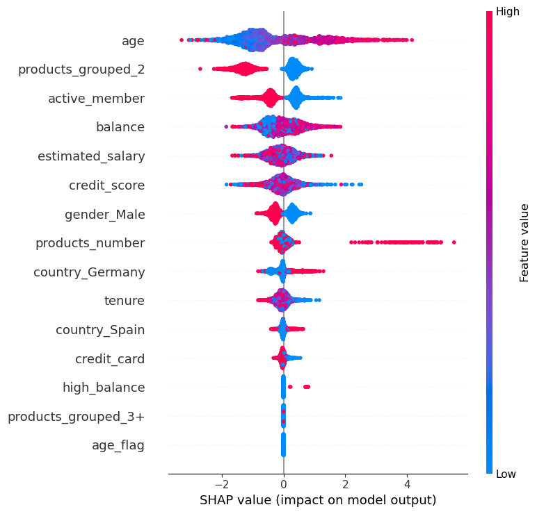

#  Customer Churn Prediction with XGBoost

This project uses real-world banking-style customer data to predict churn likelihood using machine learning models. It combines exploratory data analysis, model comparison, SHAP explainability, and business recommendations.

##  Problem Statement

Churn is a major threat to subscription-based or fintech companies. This project identifies high-risk customers and builds a predictive model to inform retention strategy.

##  Business Recommendations Summary

Based on our findings, we suggest:

- Proactively engage **older customers** with retention incentives.
- Target **inactive users** with personalized outreach campaigns.
- Encourage bundling of exactly **2 products**, which correlates with lower churn.
- Monitor **high-balance clients** closely as they show elevated churn risk.


##  Tools Used

- Python (Pandas, Scikit-learn, XGBoost, SHAP, Seaborn)
- Jupyter Notebook
- Matplotlib / Seaborn for visualization
- SHAP for explainability

> To install dependencies:
pip install -r requirements.txt

##  Models Evaluated

| Model | Accuracy | Recall (Churn) | F1-Score | ROC AUC |
|-|-|-|-|-|
| Logistic Regression| 0.85 | 0.41 | 0.52 | 0.84 |
| Random Forest | 0.87 | 0.48 | 0.59 | 0.86 |
| **XGBoost (Best)** | 0.86 | **0.51** | **0.59** | **0.85**|

 **XGBoost** was selected as the final model due to its best performance in recall and balanced precision.

##  Key EDA Insights & SHAP Insights

- Older customers are more likely to churn.
- Customers with low engagement (inactive members) have the highest churn probability.
- Holding exactly 2 products is correlated with **lower churn risk** — bundling may help.
- Female users show slightly higher churn risk than males (from SHAP interpretation).
- Higher balances contribute positively to churn probability — worth deeper financial segmentation.

These insights were derived using **SHAP (SHapley Additive Explanations)** to visualize feature impact and model transparency.


##  Explainable AI (SHAP)

We used SHAP to interpret feature contributions globally and locally. This allows business teams to trust model predictions and take action on key drivers like age and activity level.



##  Predicting Churn for New Customers (Model Inference)

This project includes a production-ready script for making churn predictions on new customer data.

```python
from infer import predict_customer

# Example: [credit_score, age, tenure, balance, products_number, credit_card,
# active_member, estimated_salary, age_flag, high_balance, country_Germany,
# country_Spain, gender_Male, products_grouped_2, products_grouped_3+]

customer = [650, 45, 1, 20000, 1, 1, 1, 75000, 0, 0, False, False, True, False, False]
result = predict_customer(customer)
print("Churn Prediction:", "Yes" if result == 1 else "No")
```

##  Project Structure

- `notebooks/`: Python notebooks for modeling & EDA
- `data/`: Cleaned datasets used in training
- `images/`: Visuals for plots and explainability
- `models/`: Trained model files
- `reports/`: Summary reports and findings

##  Author

Yang Chen  
Data Analyst | Applied AI Enthusiast  
[LinkedIn](https://www.linkedin.com/in/yang-chen-34a6401a1/) | [Portfolio](#)
